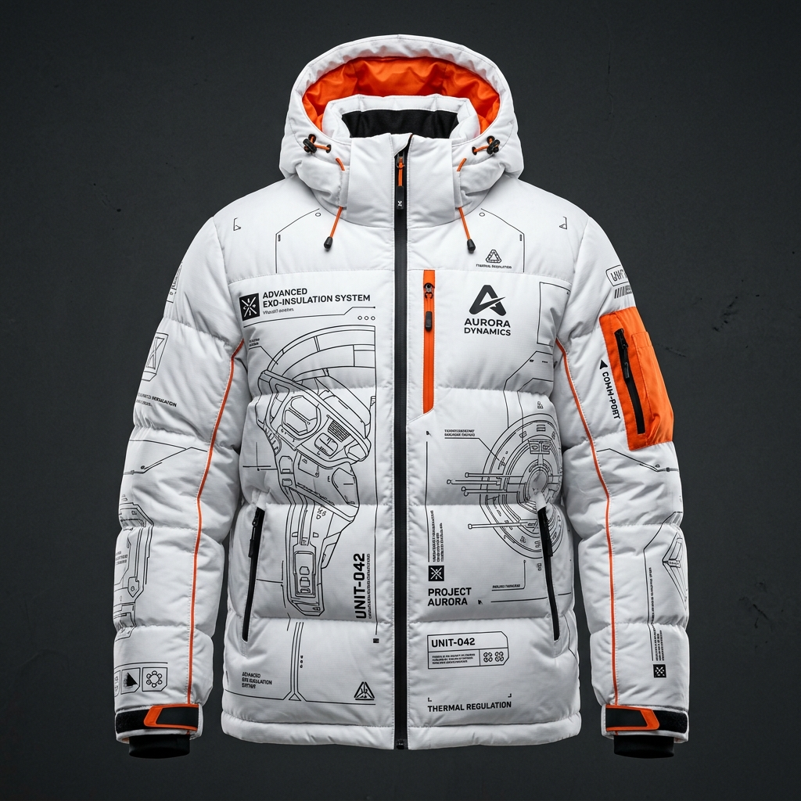

# Astro Apparel Labs - Winter Armor II 🚀



Welcome to the **Astro Apparel Labs** digital storefront and telemetry dashboard. This premium, sci-fi-themed e-commerce web application showcases tactical planetary and orbital exploration gear using modern, dynamic web design. 

This project was built as a highly creative, immersive product landing page featuring live biometric telemetry simulations, dynamic interactive blueprints, and deep-space aesthetic details.

## ✨ Features

- **Immersive SPA Navigation:** A seamless Single Page Application (SPA) feel constructed purely with Vanilla JS, HTML, and CSS.
- **Dynamic Product Viewer:** Product cards inject custom color ways, sizes, and hotspot metadata dynamically into the main viewer without reloading.
- **Biometric Dashboard (Hero Page):** An interactive homepage featuring simulated live telemetry from different planetary explorer units (Mars, Venus, Earth Orbit).
- **Interactive Blueprints:** Toggleable blueprint overlay mode for the flagship "Armor II Jacket", revealing detailed x-ray schematics.
- **HUD Diagnostics UI:** Interactive system switches that activate a heads-up display overlay on the product images.
- **Responsive Layout:** A fluid grid architecture that adapts the tech-heavy interface for mobile, tablet, and desktop screens.
- **Sci-Fi Soundscapes:** Subtle, synthesized UI sounds mapped to key interactions (hovering, navigation, alerts) utilizing the Web Audio API. 
- **Premium Aesthetics:** Features glassmorphism effects, floating glowing elements, particle overlays, and SVG micro-animations that deliver a high-end web experience.

## 🛠️ Technology Stack

- **HTML5:** Semantic architecture housing SVG icons and modular data-views.
- **Vanilla CSS3:** Extensive custom stylesheet built with CSS Variables, Flexbox/Grid systems, media queries, and high-performance keyframe animations (`transform`, `opacity`, `filter`).
- **Vanilla JavaScript (ES6+):** Complete state management, DOM manipulation, SPA routing, audio synthesis, and interactive events with zero external dependencies.

## 🚀 Getting Started

To run this project locally, simply clone the repository and serve it using a local development server. 

### Prerequisites

You need a way to serve static files. If you have Python installed, you can use its built-in HTTP server:

```bash
# Clone the repository
git clone https://github.com/Chari24/ASTRO-APPAREL-LABS.git

# Navigate into the project folder
cd ASTRO-APPAREL-LABS

# Start a local development server (Python 3)
python -m http.server 8080
```
Then navigate to `http://localhost:8080` in your web browser.

## 📦 Project Structure

```text
├── index.html       # The main entry point housing all views
├── style.css        # Core stylesheet (Variables, Animations, Components)
├── app.js           # Core application logic, routing, and Web Audio API 
└── assets/          # Directory containing all high-resolution images and SVGs
```

## 🎨 Design System

- **Primary Colors:** Deep Space Dark `#0a0b0d`, Safety Orange `#ff6a00`, and Cyan `#00e5ff`.
- **Typography:** 
  - `Outfit` - Tech headers and primary labels.
  - `Share Tech Mono` - Telemetry nodes, raw data displays, and system logs.
  - `Inter` - Highly readable body descriptions.

## 🤝 Contribution & Usage

This project is a design demonstration piece. Feel free to fork, dissect, and use the custom interactive UI patterns in your own sci-fi interfaces and web experiments!
